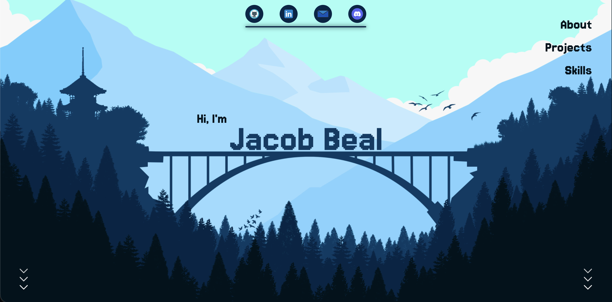

<p align="center">
  <a href="https://github.com/FroostySnoowman">
   🏠 Go back to my GitHub home page 🏠 
  </a>
</p>

---

# 📌 Portfolio



## 📝 Overview

Portfolio deployed on `GitHub Pages`. The main idea behind this portfolio was to use the `parallax` effect.

This site is animated and responsive, but nothing beats visiting it to see for yourself.
- 🚀 [Go to my portfolio](https://froostysnoowman.github.io)

## Deploy to froostysnoowman.github.io

The site is a static export and is meant to be served at **https://froostysnoowman.github.io**.

### 1. Create the GitHub Pages repo

- On your **FroostySnoowman** account, create a repo named exactly **`froostysnoowman.github.io`** (empty is fine).
- GitHub will serve it at **https://froostysnoowman.github.io**.

### 2. Build and deploy from this repo

From your **Portfolio** project:

```bash
npm run build
npm run deploy
```

The first time you run `npm run deploy`, you’ll be prompted to log in to GitHub if needed. The script pushes the contents of the `out` folder to the **main** branch of **FroostySnoowman/froostysnoowman.github.io**.

### 3. After deploy

- Wait a minute or two, then open **https://froostysnoowman.github.io**.
- To update the site: run `npm run build` and `npm run deploy` again from this project.

---

## 🧰 Toolbox


---
<p align="center">
  <a href="https://github.com/FroostySnoowman">
   🏠 Go back to my GitHub home page 🏠 
  </a>
</p>
